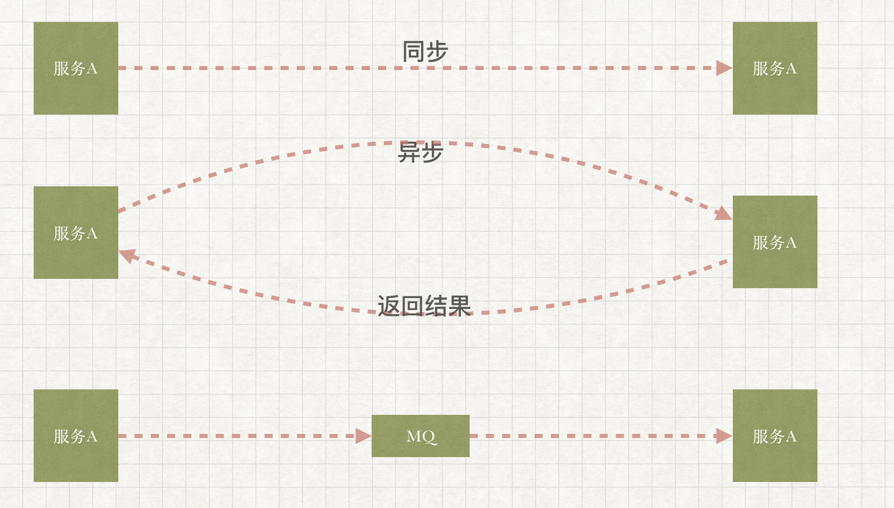
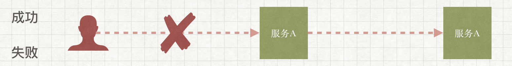
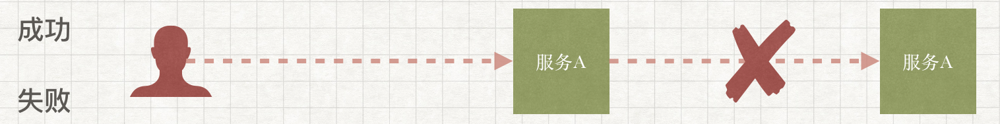
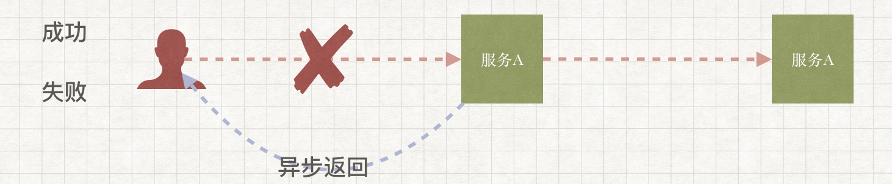
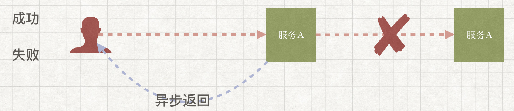
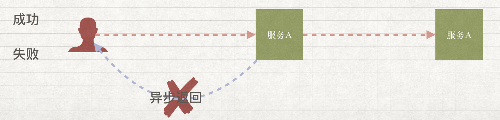

## 数据不一致性的由来
传统行业里单体应用随处可见，随着互联网时代的来临，单体应用已经在性能上无法满足业务要求，单体应用也开始出现池化，一个实例无法满足，集部署多个实例。
互联网行业技术复杂度变高的重要原因就是来源于拆分，比如数据库单表有性能问题怎么办？单实例应用有性能问题怎么办？单节点缓存有问题怎怎么办？一个“拆”字全部搞定。
拆分也表达了一种对复杂事物分而治之的思想和逻辑，拆是不可以避免的，那么该怎么拆呢？
* 水平拆分：一个节点无法满足，就把这一个节点复制为多个，多个节点具有一致的功能，组成一个服务池，一个节点服务于一部分请求
* 垂直拆：按功能进行拆分，秉承着让“专业人干专业事”原则，把一个复杂的功能拆分为多个单一、简单的功能，将不同的单一功能组合在一起（有点微服务的意思吧）

**拆分后的系统或服务化后的系统最大的挑战和问题就是数据一致性**

解决数据的一致性有一些思路，比如ACID、CAP、BASE、最终一致性，但这些不在本篇文章讨论范围。

本文着重说明在服务化架构里，服务和服务间通过网络通信，而由于网络不稳导致超时情况下如何保证数据一致性，给出一些切实可行的解决办法

## 服务间调用模式
服务间调用方式大致可以分为三种，同步、异步、MQ，如下图

针对于这三种方式，分析一下可能发生的问题和适用场景

### 同步
服务A调用服务B时，服务A需要阻塞等待服务B的返回，如果服务B一直不返回结果，服务A将一直等待到超时为止

适用于大规模、高并发但不是很耗时的操作，不适用于耗时较高的场景

### 异步
服务A调用服务B，服务B立刻返回给服务A调用成功，服务A继续其它操作，服务B接受服务A请求后执行相应的业务逻辑，处理完成后通知服务A

适用于非核心链路上负载较大、耗时较高的场景使用

### MQ
服务A将消息发送给服务B，而不需要服务B返回任何结果，这时服务A可以将消息发送给MQ，让消息异步的通知服务B，与异步调用的差异主要有两个
* 服务A于服务B在业务层面（具体的业务场景）充分的解耦
* 在大规模、高并发的场景下MQ对流量有消峰的作用

适用于非核心链路上负载较大、耗时较高，且服务间不关心上下游处理结果的场景

### 同步/异步如何选择
同步/异步就两个选项，不是同步就是异步，但是选择的出发点却不同

#### 能同步解决的问题，不要引入异步
从技术和架构的角度考虑，如果性能不是问题，服务间调用都是轻量级操作，同步方式是最好的选择，不需要引入异步复杂化处理流程

#### 尽量使用异步来替换同步操作
从业务功能的角度考虑，业务层面允许，将一些耗时较长、负载较高的处理异步化，减少核心链路的负载，释放系统压力

## 超时解决方案
切入正题，本篇文章主要是归纳、总结一下在服务间调用时发生超时后，如何保证数据一致性，将分别对同步、异步、MQ进行阐述，并且给出可行的解决方案

### 同步

同步调用中接口返回的状态定义可以有两种方式
* 成功、失败
* 成功、失败、处理中
我将针对这两种接口状态在超时发生时该如何解决进行说明

超时发生在客户端调用服务A接口时，服务A需要提供一个查询接口，向客户端返回操作的执行状，如果查询接口返回失败，客户端可以发起重试。对于服务A不提供查询接口，客户端在超时发生时自动重试，此时服务A的接口需要保证幂等。

超时发生在服务A于服务B之间，此时服务A必须使用快速失败策略，因为接口状态只有成功和失败，没有中间状态。服务A返回给客户端失败的同时还必须调用服务B的冲正接口，判断服务B是否接受到了服务A的请求，如果接受到了，则执行回滚操作，如果没接受掉，忽略冲正请求。

和之前两种状态接口客户端调用失败处理逻辑一样，只要返回状态为“处理中”就调用服务A的查询接口。

服务A调用服务B超时，服务A返回给客户端处理中状态，服务A调用服务B的查询接口，尽最大努力补偿可能出错的部分，服务B的接口要好幂等处理。这种策略变相的把同步接口变成异步接口，以达到数据最终一致的效果，要考虑到业务场景是否适用。

### 异步

超时出现在客户端调用服务A，客户端通过服务A的查询接口来判断后续的操作

服务A要根据服务B的查询接口返回的状态判断后续的操作，在服务B返回处理成功时异步通知客户端

服务A要保证异步消息一定可达，当不可达时消息时，按一定间隔递增的策略通知客户端，直到通知成功

### MQ

服务A将消息发送给mq前先，将消息持久化到数据库，状态标记为待发送，消息发送成功后，将消息标记为发送成功，通过定时任务从数据库中捞取发送失败的消息

MQ都有对应的可靠性消费策略，更具不同的MQ选择合适的策略就可以了