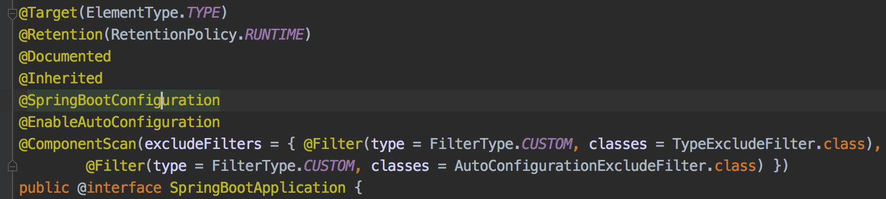
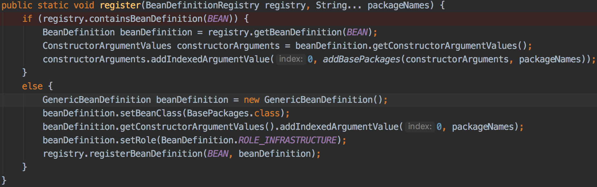
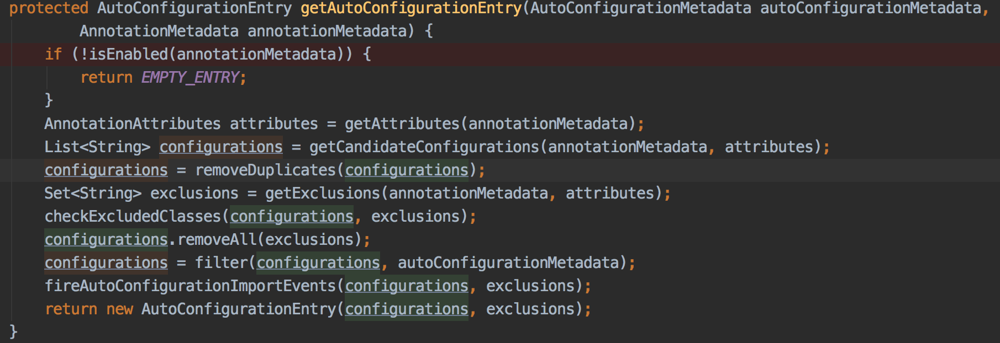

## hello springboot

### 创建Springboot项目
* eclipse sts 插件
* idea Spring Assistant 插件
* https://start.spring.io/

### pom说明
* 使用start parent
```xml
<parent>
    <groupId>org.springframework.boot</groupId>
    <artifactId>spring-boot-starter-parent</artifactId>
    <version>2.2.2.RELEASE</version>
</parent>
```
* 使用parent pom
```xml
<dependencyManagement>
    <dependencies>
        <dependency>
            <!-- Import dependency management from Spring Boot -->
            <groupId>org.springframework.boot</groupId>
            <artifactId>spring-boot-dependencies</artifactId>
            <version>2.2.2.RELEASE</version>
            <type>pom</type>
            <scope>import</scope>
        </dependency>
    </dependencies>
</dependencyManagement>
```
* 依赖
```xml
<dependency>
    <groupId>org.springframework.boot</groupId>
    <artifactId>spring-boot-starter-web</artifactId>
</dependency>

<dependency>
    <groupId>org.springframework.boot</groupId>
    <artifactId>spring-boot-starter-test</artifactId>
    <scope>test</scope>
</dependency>

<dependency>
    <groupId>org.springframework.boot</groupId>
    <artifactId>spring-boot-configuration-processor</artifactId>
    <optional>true</optional>
</dependency>

<dependency>
    <groupId>org.springframework.boot</groupId>
    <artifactId>spring-boot-devtools</artifactId>
    <scope>runtime</scope>
    <optional>true</optional>
</dependency>

<dependency>
    <groupId>org.projectlombok</groupId>
    <artifactId>lombok</artifactId>
    <optional>true</optional>
</dependency>
```

### 启动方式
* ide启动
```java
// 启动类使用@SpringBootApplication标注
 SpringApplication.run(HelloWorldApplication.class, args);
```
* 打包启动
```xml
<plugin>
    <groupId>org.springframework.boot</groupId>
    <artifactId>spring-boot-maven-plugin</artifactId>
</plugin>
```

### banner
* banner可以修改，可以定制，也可以是图片
* banner必须放在resources目录下
* banner的文件必须定义为`banner.txt`，图片必须定义为`banner.jpg`
```java
SpringApplication application = new SpringApplication(HelloWorldApplication.class);
application.setBannerMode(Banner.Mode.OFF);
application.run(args);
```

### IDEA插件
* Spring Assistant
* Maven Helper
* Lombok

## 组件注册

## 自动装配

## 自动扫描和自动装配
1. 所有的启动类中只包含了`@SpringBootApplication`注解，这个注解就是springboot自动扫描和组件自动配置的入口



`@ComponentScan`主要是过滤掉一些类
`@SpringBootConfiguration`就是对`@Configuration`包装了以下
```java
@Configuration
public @interface SpringBootConfiguration{}
```
`@EnableAutoConfiguration`重点就是这个注解了
```java
@AutoConfigurationPackage
@Import(AutoConfigurationImportSelector.class)
public @interface EnableAutoConfiguration {
```
`@AutoConfigurationPackage`处理包自动扫描
`AutoConfigurationImportSelector.class`处理组件自动装配

2. 自动包扫描
```java
@Import(AutoConfigurationPackages.Registrar.class)
public @interface AutoConfigurationPackage {}
```
Registrar是AutoConfigurationPackages类中的一个静态内部类，处理了默认包扫描相关的逻辑，最终调用了register()

方法中`packageNames`就是启动类所在的包路径，IoC容器会扫描与启动类同级包和启动类子包中相关的注解bean

3. 组件自动装配
`AutoConfigurationImportSelector`实现了`AutoConfigurationImportSelector`接口，必须实现`selectImports()`向容器中注入组件，其中核型方法是`getAutoConfigurationEntry`

`getCandidateConfigurations()`中加载了spring-boot-autoconfigure-2.2.2.RELEASE.jar包下/MATE-INF/spring.factories文件中key为`org.springframework.boot.autoconfigure.EnableAutoConfiguration`的所有类，共计127个
`removeDuplicates()`移除掉重复的
`getExclusions()`获取需要排除的类，通过`ConditionalOnClass`排除掉不需要加载的类
`filter()`过滤后最终返回需要加载的类，执行自动装配

## @Component/@Bean + @ConfigurationProperties/@Value
* .properties优先于.yml
* .properties和.yml配置互补
* @Value .properties不能读取map
* @Value .yml不能读取数组、集合、map

## @PropertiesSource + @Value
## @ImportResource

* @JsonFormat json相应转换
* @DateTimeFormat 请求参数字符串转Date spring.mvc.date-format